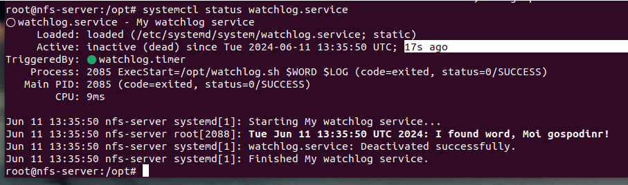

# homework-systemd

Описание домашнего задания
---
1. Написать service, который будет раз в 30 секунд мониторить лог на предмет наличия ключевого слова (файл лога и ключевое слово должны задаваться в /etc/default)
2. Установить spawn-fcgi и создать unit-файл (spawn-fcgi.sevice) с помощью переделки init-скрипта (https://gist.github.com/cea2k/1318020).
3. Доработать unit-файл Nginx (nginx.service) для запуска нескольких инстансов сервера с разными конфигурационными файлами одновременно.

ОС для настройки: Ubuntu 24.04 (для работы решил использовать ВМ из предыдущего ДЗ, потому что "почему бы и нет))" 

Vagrant версии 2.4.1

VirtualBox версии 7.0.18


---
- Этап 1: Написать service, который будет раз в 30 секунд мониторить лог на предмет наличия ключевого слова (файл лога и ключевое слово должны задаваться в /etc/default)

Создал файл с конфигурацией для сервиса - из этого файла сервис будет брать необходимые переменные.

Директории /etc/default

Переменные тут WORD и LOG

```bash
nano /etc/default/watchlog
```  


Создал файл с логами, в котором есть ключевое слово для поиска watchlog.log

Директория /var/log/

```bash
nano /var/log/watchlog.log
``` 


Создал скрипт, который будет искать ключевое слово в логах (+ дал права на исполнение)

```bash
nano /opt/watchlog.sh
chmod +x /opt/watchlog.sh
``` 


Далее создал непосредственно юнит для сервиса

```bash
nano /etc/systemd/system/watchlog.service
``` 


И создал юнит для таймера

Как я понимаю, механизм такой, что мы дергаем таймер, он из себя дергает сервис. Но не запускает его обычным образом, а однократно исполняет (потому что сервис не запущенным остается)

```bash
nano /etc/systemd/system/watchlog.timer
``` 


Запускаем, проверяем

```bash
systemctl start watchlog.timer
systemctl status watchlog.timer
``` 


Ждем 30 секунд и.......нифига. Почему то watchlog.timer запустить оказалось недостаточно, когда пнул watchlog.service, логи пошли

При этом видно, что таймер прибивает сервис, но все отрабатывается. То есть watchlog.service не висит постоянно активным, но видно, что запускался по таймеру, потом отключится 





---

- Этап 2: Установить spawn-fcgi и создать unit-файл (spawn-fcgi.sevice) с помощью переделки init-скрипта

Устанавливаем spawn-fcgi и необходимые для него пакеты

```bash
apt install spawn-fcgi php php-cgi php-cli apache2 libapache2-mod-fcgid -y
#Так, ну тут, скорее всего, была проблема c репозиторием,
#так что заменил на зеркало от Яндекса. "Скорее всего" -
#потому что может надо было sudo apt update сначала
#попробовать :D, а я как-то сходу полез репо смотреть…
```


Залез в /etc/apt/sources.list
и заменил репозитории на зеркало deb http://mirror.yandex.ru/ubuntu


Cоздал файл с настройками для будущего сервиса

```bash
nano /etc/spawn-fcgi/fcgi.conf
#Директории не было, создал
mkdir /etc/spawn-fcgi
```


Создал юнит-файл для сервиса

```bash
nano /etc/systemd/system/spawn-fcgi.service
```


Проверяем

```bash
systemctl start spawn-fcgi
systemctl status spawn-fcgi
```


- Этап 3: Доработать unit-файл Nginx (nginx.service) для запуска нескольких инстансов сервера с разными конфигурационными файлами одновременно

Модифицируем исходный service для использования различной конфигурации, а также PID-файлов

Для этого создал новый юнит для работы с шаблонами

```bash
nano /etc/systemd/system/nginx@.service
```


Создал 2 файла конфигурации (взял дефолтный, и изменил в нем параметры pid /run/nginx....добавил listen 9001....закоментил строку

```bash
nano /etc/nginx/nginx-first.conf
```


Не завелось....ну, полезли смотреть


Судя по логу, что-то не так в nginx-first.conf. (Упустил строку, которую надо закоментить)

Закомментировал, завелось 


Проверяем 

```bash
systemctl start nginx@first
systemctl start nginx@second
systemctl status nginx@second
```


```bash
ss -tnulp | grep nginx
```


```bash
ps afx | grep nginx
```

